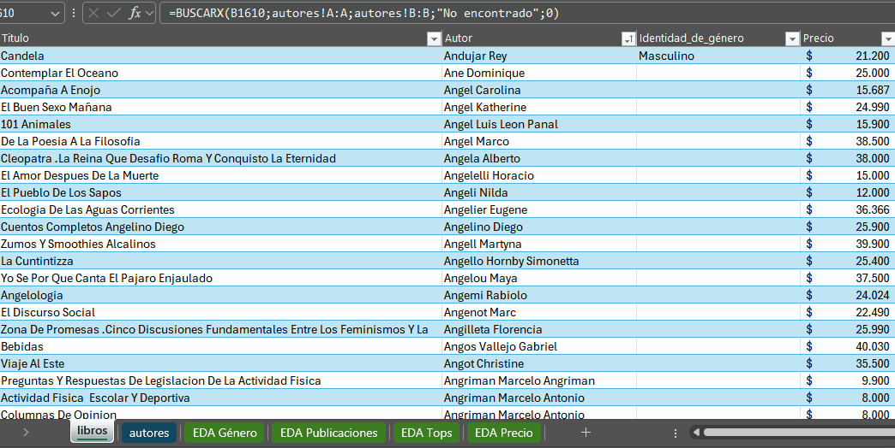

# 📚 Reporte de Análisis de Catálogo Editorial

## 1. Resumen Ejecutivo

Este proyecto nace con el objetivo de explorar el mercado editorial actual utilizando datos reales obtenidos mediante **Web Scraping**. Logré transformar una base de datos propia de **44,489 títulos** en un panel interactivo diseñado para la toma de decisiones.

Durante el desarrollo, me enfocqué en identificar patrones de precios, el liderazgo de las editoriales y la distribución de género en la autoría. Uno de los mayores aprendizajes fue resolver técnicamente el "problema de empates" en rankings mediante **DAX**, asegurando que los gráficos muestren la información exacta y visualmente limpia.

---

## 🛠️ Tech Stack

* **Extracción:** Python (Web Scraping para recolección de datos).
* **Limpieza y ETL:** Microsoft Excel (Uso de fórmulas anidadas y Power Query).
* **Modelado:** Power BI (Implementación de Esquema de Estrella).
* **Cálculos:** DAX (Data Analysis Expressions).

---

## 2. Metodología: El Ciclo del Dato

Para asegurar que el análisis fuera confiable y profesional, seguí este proceso:

### 2.1 Extracción y Enriquecimiento

* **Web Scraping:** Recolecté títulos, autores, editoriales y precios en tiempo real de una librería líder.
* **Enriquecimiento de Datos:** Realicé una investigación adicional para identificar el **género de los autores**, lo que me permitió crear un perfil de autoría que no existía en la fuente original.

### 2.2 Ingeniería de Limpieza y Normalización (Excel)

Debido a que los datos venían directamente de la web, realicé un trabajo exhaustivo de limpieza para que el modelo funcionara correctamente:

<p align="center">
  
  <br>
  <em>Uso de la función =BUSCARX() para el enriquecimiento de la identidad de género.</em>
</p>

#### **A. Calidad y Consistencia de Datos**

* **Gestión de Errores:** Eliminé registros con años erróneos (como `9999`) y filas sin **ISBN** o **Precio** para mantener la integridad de los promedios.
* **Depuración:** Filtré productos ajenos al catálogo editorial como "Gift Cards".
* **Corrección de Encoding:** Arreglé errores tipográficos comunes en scraping (ej. `á` → `á`, `ñ` → `ñ`) para que los textos se lean correctamente.

#### **B. Normalización Mediante Fórmulas**

Utilicé funciones avanzadas para estandarizar miles de filas de forma automática:

* **Formato de Texto:** `=NOMPROPIO()` para corregir mayúsculas.
* **Extracción de Autores:** Creé una fórmula anidada para extraer solo al autor principal en casos de co-autoría:  
    `=NOMPROPIO(SI.ERROR(IZQUIERDA([@Autor];HALLAR(";";[@Autor])-1);[@Autor]))`
* **Limpieza de Ruidos:** Uso de `=SUSTITUIR(ESPACIOS([@Autor]);"...";"")`.

#### **C. Transformación de Datos**

* **Formatos Numéricos:** Eliminé unidades de medida (`g`) y corregí los formatos de moneda para poder realizar cálculos matemáticos en Power BI.
* **Cruce de Datos:** Usé `=BUSCARX()` para integrar la identidad de género asignada a cada autor:  
    `=BUSCARX(B2;autores!A:A;autores!B:B;"No encontrado";0)`

### 2.3 Análisis Exploratorio (EDA en Excel)

Antes de pasar a Power BI, audité los datos con herramientas nativas de Excel:

* **Tablas Dinámicas:** Para validar que los promedios y recuentos fueran consistentes entre categorías.
* **Gráficos de Comparación:** Para detectar visualmente si alguna editorial o precio presentaba anomalías.
* **Segmentadores (Slicers):** Implementé filtros rápidos para interactuar con los datos y verificar su coherencia.
* **Optimización de Interfaz y UX:**
  
   1. Se implementó la **protección de hojas** con permisos específicos, permitiendo la interacción total con segmentadores pero bloqueando la edición accidental de celdas clave.
   2. Se aplicó el bloqueo de **relación de aspecto y posición** en todos los gráficos; esto asegura que los elementos visuales mantengan su estructura fija y profesional, sin deformarse ni desplazarse durante el filtrado de datos.
* **Protección de Datos e Integridad:** Se bloquearon las hojas de "Catálogo" y "Autores" para resguardar la fuente de origen, configurando los permisos de modo que la seguridad de Excel no interfiera con la actualización automatizada del modelo en Power BI.

<p align="center">
  
  <br>
  <em>Uso de la función =BUSCARX() para el enriquecimiento de la identidad de género.</em>
</p>

---

## 3. Modelo y Diccionario de Datos

Diseñé un **Esquema de Estrella** para que el reporte sea rápido y eficiente.

| Tabla | Campo | Tipo de Dato | Descripción |
| :--- | :--- | :--- | :--- |
| **Fact_Catalogo** | `ISBN` | Número (Key) | Identificador único del libro (Llave Primaria). |
| **Fact_Catalogo** | `Precio` | Decimal | Valor de venta al público. |
| **Dim_Autor** | `Identidad` | Texto | Género del autor (Masculino/Femenino). |
| **Dim_Editorial** | `Editorial` | Texto | Sello responsable de la publicación. |
| **Dim_Libro** | `Año` | Fecha/Año | Año de lanzamiento o edición. |

---

## 4. Desafío Técnico: Rankings de Precisión (DAX)

Un reto interesante en Power BI es cuando varios libros tienen el mismo precio. Esto hace que un "Top 5" muestre más de 5 elementos, lo cual ensucia el reporte visualmente.

**Mi Solución:** Desarrollé una medida de desempate usando `RANKX`. La lógica consiste en tomar el precio y sumarle un valor mínimo (infinitesimal) basado en el nombre del libro, logrando así un ranking único y exacto.

```text
Desempate Libros = 
VAR Conteo = [Precio Máximo] 
VAR RankingUnico = 
    RANKX(
        ALL(Fact_Catalogo[Titulo]), 
        CALCULATE(SELECTEDVALUE(Fact_Catalogo[Titulo])), 
        , 
        ASC
    )
RETURN
IF(
    NOT ISBLANK(Conteo),
    Conteo + DIVIDE(RankingUnico, 1000000)
)

```

[INSERTAR AQUÍ: 03_Images/resultado_dax.png]

---

## 5. Visualización y Hallazgos (Insights)

* **Concentración de Mercado:** Detecté que el sello **Ivrea** lidera el volumen con **1,083 títulos**, mostrando una clara especialización en su sector.
* **Análisis por Género:** El catálogo se distribuye en un **61.13% (M)** frente a un **38.87% (F)** en autoría.
* **Benchmarking:** El precio promedio global es de **$27,826**, lo que sirve como base para comparar precios entre distintas categorías.


---

## 6. Estructura del Repositorio

* 📁 **01_Data**: Carpeta con los datos `Raw` y los datos finales `Processed`.
* 📁 **02_Report**: El archivo `.pbix` con el dashboard interactivo.
* 📁 **03_Images**: Capturas de pantalla y demostraciones visuales.

---

# 📑 Reporte Ejecutivo: Análisis de Inventario y Catálogo Editorial

**Para:** Dirección de Compras / Gerencia de Stock  
**De:** M. Cristina Castro (Analista de Datos Junior)  
**Fecha:** Diciembre 2025  
**Asunto:** Hallazgos clave y recomendaciones estratégicas basadas en el catálogo actual.

---

### 1. Resumen de Situación

El presente reporte sintetiza el análisis realizado sobre un dataset de **44,522 registros** y **23,023 autores**. El objetivo principal fue normalizar y enriquecer la información para obtener indicadores confiables de gestión. Se determinó que el **precio promedio general** del catálogo se sitúa en **$27,826**, observándose una fuerte concentración de títulos en géneros específicos.

---

### 2. Hallazgos del Análisis

* **Impacto Histórico (Pandemia):** Se identificó una **caída pronunciada** en el volumen de publicaciones durante el periodo **2020-2021**. Tras validar la integridad de los datos, se confirmó que este fenómeno no responde a errores de carga, sino a una interrupción real del mercado que rompió una tendencia de crecimiento sostenido iniciada en 1991.
* **Concentración de Proveedores:** Tres sellos editoriales (**Ivrea, Planeta y Penguin**) concentran la mayor parte de la oferta actual. Esto indica una alta dependencia de estos proveedores y sugiere una oportunidad para explorar editoriales independientes que permitan diversificar el stock.
* **Perspectiva de Género:** Gracias al proceso de enriquecimiento de datos (mediante `BUSCARX` y validación manual), se detectó que el **38.87%** de la autoría es femenina. Este KPI es fundamental para diseñar futuras estrategias de inclusión y equilibrio en el catálogo comercial.

---

### 3. Nota sobre la Calidad de los Datos (ETL)

Para asegurar que las visualizaciones y conclusiones fueran veraces, se ejecutaron procesos críticos de limpieza:

* **Corrección de Fechas:** Se identificaron y trataron años inválidos (como el valor **9999**), asegurando que las líneas de tiempo reflejen la evolución real del mercado.
* **Normalización de Nombres:** Se eliminaron más de **20 tipos de errores de "ruido tipográfico"** en los nombres de editoriales y autores, garantizando que los filtros y segmentadores de Power BI y Excel funcionen con precisión total.

---

### 4. Sugerencias Iniciales

1. **Revisión de Stock 2020-2021:** Se sugiere auditar las colecciones de estos años para identificar posibles faltantes o "huecos" bibliográficos generados por la baja producción mundial durante la pandemia.
2. **Monitoreo de Categorías Premium:** Dado que los sectores de **Tecnología e Ingeniería** registran los precios más altos, se recomienda un seguimiento cercano de sus márgenes para mantener la competitividad en el mercado.
3. **Optimización de Segmentos:** Utilizar los datos de género obtenidos para nivelar la oferta en categorías donde la brecha de autoría es más pronunciada.

## 🚀 Cómo utilizar este proyecto

1. Descarga o clona este repositorio.
2. Los datos limpios están en `01_Data/Processed`.
3. Abre el archivo de Power BI y, si es necesario, actualice la ruta de los datos en **Configuración de origen de datos** para que apunte a tu carpeta local.

---

## 💡 Nota del Autor

Este proyecto me permitió fortalecer mis habilidades en el ciclo completo del dato, desde la extracción hasta la visualización estratégica. Si tienes alguna sugerencia o feedback, ¡será muy bienvenido!
